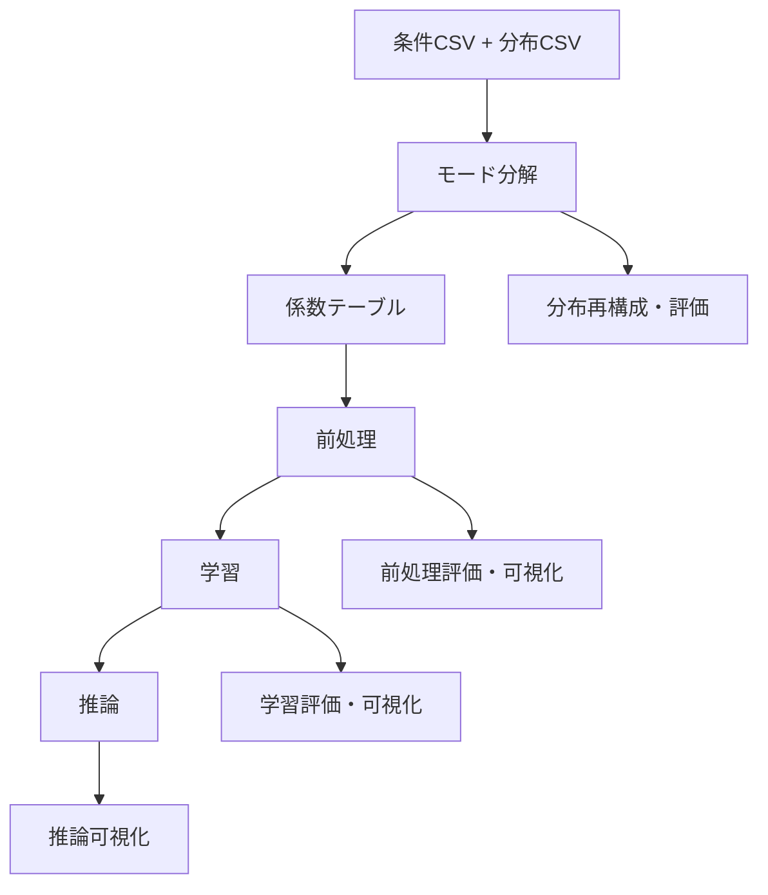

# コード構成

## ディレクトリ構成（主要）
※ Codex CLI 用（codex/・agentskills/・autopilot.sh など）は記載対象外。

| ディレクトリ | 役割 | 主な内容 | 変更が発生しやすいケース |
| --- | --- | --- | --- |
| `src/` | 本体実装 | パイプライン / データ / 可視化 / モード分解 / 学習 / 推論 | 新機能追加・アルゴリズム変更 |
| `configs/` | Hydra 設定 | task / dataset / domain / model / decompose / inference など | 実行方法追加・既定値変更 |
| `examples/` | 実行例 | run.yaml のサンプル | ユースケース追加 |
| `data/` | サンプルデータ | テストデータセット（CSV/NPY） | 評価データの追加・更新 |
| `tools/` | 補助ツール | データ生成・移行・検証ツール | 運用改善 |
| `tests/` | テスト | E2E / 単体 | 仕様変更やバグ修正 |
| `docs/` | 既存ドキュメント | 仕様・設計・方針 | 仕様の整理・追加 |

## 主要パッケージ（`src/mode_decomp_ml`）
| パッケージ | 役割 | 代表ファイル |
| --- | --- | --- |
| `pipeline/` | 実行フローと入出力管理 | `pipeline.py`, `artifacts.py`, `utils.py` |
| `data/` | データローダ | `datasets.py`, `manifest.py` |
| `plugins/` | モード分解/前処理/学習の実装 | `decomposers/`, `coeff_post/`, `codecs/` |
| `viz/` | 可視化 | `viz/__init__.py` |
| `tracking/` | ログ/追跡 | `clearml.py`, `leaderboard.py` |
| `evaluate/` | 評価指標 | `evaluate/__init__.py` |

## 主要エントリ
| ファイル | 内容 |
| --- | --- |
| `src/processes/decomposition.py` | モード分解プロセス |
| `src/processes/preprocessing.py` | 前処理プロセス |
| `src/processes/train.py` | 学習プロセス |
| `src/processes/inference.py` | 推論プロセス |
| `src/processes/pipeline.py` | パイプライン実行 |
| `src/processes/leaderboard.py` | 比較集計 |
| `src/mode_decomp_ml/run.py` | CLI 入口（`python -m mode_decomp_ml.run --config run.yaml`） |

## 処理ワークフロー（mermaid）

