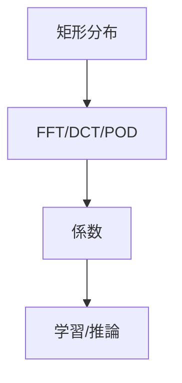
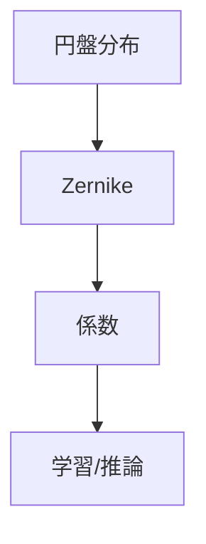
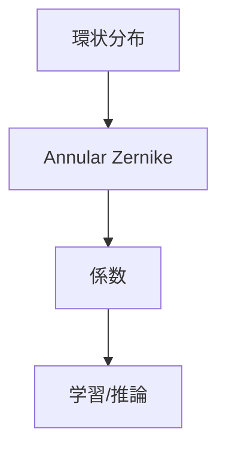
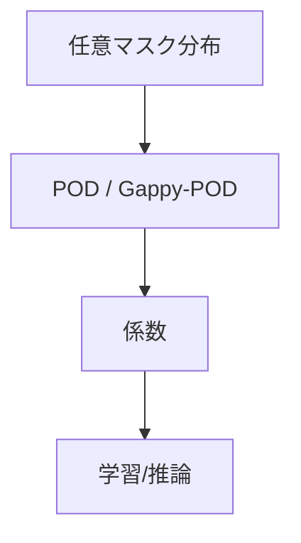
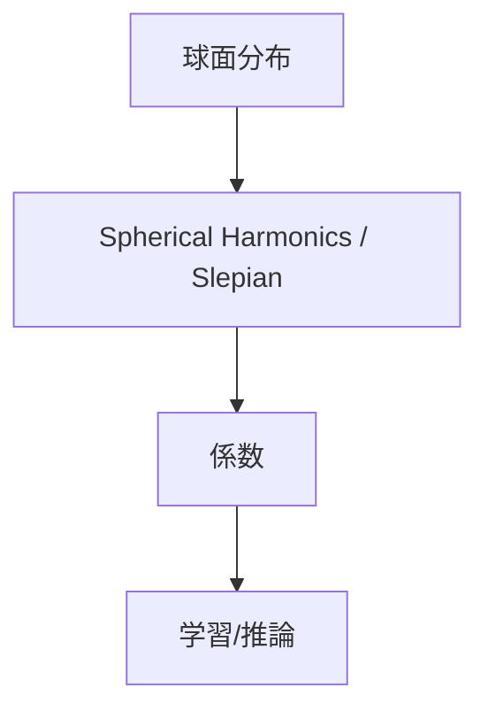

# 実行フロー（ドメイン別）

## 矩形ドメイン（rectangle）

```mermaid
flowchart TD
  A[矩形分布] --> B[FFT/DCT/POD]
  B --> C[係数]
  C --> D[学習/推論]
```

## 円盤ドメイン（disk）

```mermaid
flowchart TD
  A[円盤分布] --> B[Zernike]
  B --> C[係数]
  C --> D[学習/推論]
```

## 環状ドメイン（annulus）

```mermaid
flowchart TD
  A[環状分布] --> B[Annular Zernike]
  B --> C[係数]
  C --> D[学習/推論]
```

## 任意マスク（arbitrary_mask）

```mermaid
flowchart TD
  A[任意マスク分布] --> B[POD / Gappy-POD]
  B --> C[係数]
  C --> D[学習/推論]
```

## 球面（sphere_grid）

```mermaid
flowchart TD
  A[球面分布] --> B[Spherical Harmonics / Slepian]
  B --> C[係数]
  C --> D[学習/推論]
```
