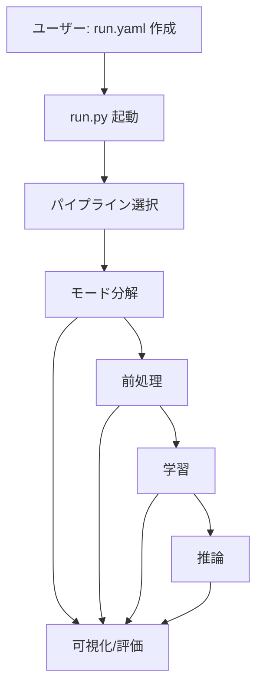

# 処理フロー

## 操作フロー（mermaid）

## ClearML 連携
- `configs/clearml` に設定がある場合、プロジェクト/タスク階層で結果を保存
- 実行単位は process ごとに分割

## 操作ぶれへの工夫
- `run.yaml` のシンプルな指定で Hydra config を統合
- 出力ディレクトリは一貫構成（再実行時は上書き）
- YAML スナップショットを configuration に保存
